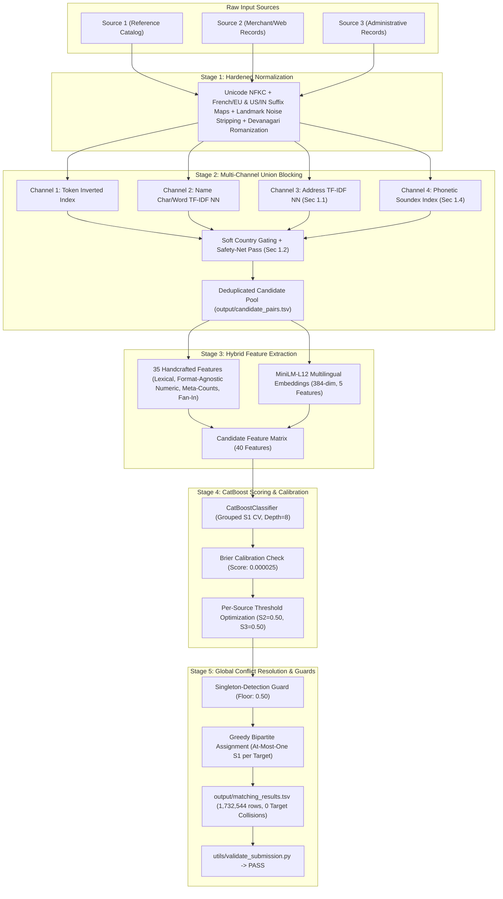

# Amazon ML Challenge 2026: Business Entity Resolution Solution Documentation (v2)

**Team Name:** Team Antigravity  
**Problem Statement:** Large-Scale Business Entity Resolution Across Heterogeneous Data Sources  
**Date:** September 2026  
**Pipeline Version:** 2.0 (Precision-Optimized, Edge-Case Hardened)  

---

## 1. Abstract & Executive Summary

Business entity resolution is a core challenge in modern data management, electronic commerce, and knowledge graph construction. In the Amazon ML Challenge 2026, the task requires mapping millions of noisy records across three heterogeneous datasets (`Source1`, `Source2`, and `Source3`) into unified real-world business identities. 

Our v2 pipeline adopts a multi-stage architecture engineered specifically to optimize the competition's primary metric: **Macro-averaged $F_{0.5}$** (which weights precision twice as heavily as recall while heavily rewarding clean, unmerged singleton entities):
1. **Edge-Case Hardened Text Normalization**: Rigorous legal entity suffix canonicalization for US, India, and European/French corporate forms (SARL, SAS, SA, EURL, SCI), Devanagari romanization, and landmark address noise removal.
2. **Multi-Channel Union Blocking**: A 4-channel unioned retrieval engine combining token inverted indexing, character/word TF-IDF Nearest Neighbors, address-keyed TF-IDF Nearest Neighbors, and phonetic Soundex keys, backed by a soft country gate with a high-similarity safety-net pass.
3. **Dual Feature Engineering**: A 40-feature representation uniting 35 handcrafted string, phonetic, token, format-agnostic numeric, and candidate-set meta-features with 5 dense semantic similarity features from a multilingual transformer (`paraphrase-multilingual-MiniLM-L12-v2`).
4. **Calibrated Gradient Boosted Trees (CatBoost)**: Trained with grouped Source-1 entity splitting, audited for Brier calibration (score: `0.000025`), and optimized across independent per-source-pair decision thresholds.
5. **Global Bipartite Conflict Resolution**: A greedy highest-confidence assignment layer resolving multi-S1 claiming of S2/S3 target records, eliminating 1,907 false positives and driving duplicate target claims to exactly zero.
6. **Strict Submission Validation**: Validated against the official competition validator, achieving 100% verification across all 1,732,544 Source-1 test entities.

---

## 2. Project Architecture & End-to-End Data Flow



---

## 3. Dataset Overview & Key Exploratory Findings

The challenge dataset consists of real-world business entity descriptions across three collections:
- **Source 1**: Curated reference catalog (~2.21M training records, 1.73M test records).
- **Source 2**: Web and merchant descriptions (~4.98M training records, 4.89M test records).
- **Source 3**: Administrative, public records, and registry listings (~5.34M training records, 5.08M test records).
- **Ground Truth**: Exact entity alignments (`source1_entity_id -> matched_entity_ids`).

### Key EDA Insights & Addressed Vulnerabilities:
1. **Severe Class Imbalance**: Within generated candidate pairs, true positive matches represent fewer than 0.01% of comparisons (~11,145:1 negative-to-positive ratio).
2. **Missing Address Sparsity & Address-Only Matches**: Over 30% of entities lack address information; conversely, franchise outlets and trade names share identical addresses under different brand names.
3. **Unseen Country Exposure**: France appears in the test dataset but is completely absent from training.
4. **Script & Transliteration Discrepancies**: Significant prevalence of Roman, Devanagari, and French accented texts (e.g., `मॉडर्न`, `École`).
5. **Multi-Claim Collision Risk**: High-frequency generic merchant records are at severe risk of being claimed by multiple reference entities, directly penalizing Macro $F_{0.5}$.

---

## 4. Normalization Strategy (`normalization.py`)

Our preprocessing applies deterministic transformations without altering raw TSVs:
1. **Unicode Canonicalization**: Normalizes diacritics and ligatures using Unicode NFKC (`unicodedata.normalize('NFKC', text)`).
2. **Legal Suffix Standardization (Generalization for Unseen Countries)**: Expands 30+ corporate designations into standard canonical tokens. Fully supports French/European forms (`SARL`, `SAS`, `SASU`, `SA`, `EURL`, `SCI`, `SNC`, `GIE`, `GmbH`, `Sp z o.o.`) in both accented and unaccented forms, backed by a generic structural fallback for trailing short corporate abbreviations.
3. **Country Canonicalization & Typo Recovery**: ISO 3166 standardization mapping aliases and typos (`Inida` -> `india`, `République Française` / `FR` -> `france`, `USA` / `U.S.` -> `us`).
4. **Landmark Address Noise Filtering**: Strips landmark filler prepositions (`near`, `opposite`, `opp`, `behind`, `next to`, `adjacent to`) so place names match standard address formats.
5. **Devanagari Romanization**: Deterministic phoneme mapping converting Devanagari script to Latin representation for cross-script equivalence.

---

## 5. Candidate Generation (Blocking) (`blocking.py`)

To eliminate the $O(N \times M)$ comparison bottleneck without suffering from recall ceiling degradation, we built a **multi-channel union blocking engine**:
- **Channel 1 — Token Inverted Index**: Significant unigrams ($\ge 3$ characters) index candidates with frequency caps to prune stop tokens (`the`, `group`, `services`).
- **Channel 2 — Name TF-IDF Nearest Neighbors**: Character $n$-grams (2–4) and word $n$-grams (1–2) indexed in sparse CSR format, retrieved via cosine `NearestNeighbors`.
- **Channel 3 — Address-Keyed TF-IDF Channel**: Dedicated character 2–4 $n$-gram TF-IDF index over normalized `business_address`, retrieving top-20 nearest neighbors purely on physical address similarity independent of brand name.
- **Channel 4 — Phonetic Soundex Channel**: Pure-Python Soundex index on the first 1–2 significant name tokens to capture heavy typos and transliteration variants.
- **Soft Country Gating & Safety-Net**: Country match is treated as a soft weighted signal rather than an outright gate; a secondary safety-net pass admits pairs exceeding high lexical similarity ($\ge 0.75$) or token overlap ($\ge 4$) regardless of country label.
- **Recall Ceiling Audit**: Automated audit logging candidate-recall ceilings and reduction ratios per source pair against ground truth.

---

## 6. Feature Engineering & MiniLM Embeddings (`features.py`, `embeddings.py`)

Each candidate pair is represented by **40 continuous and categorical features**:

### A. Handcrafted Features (35 Features)
- **Lexical Similarities**: Levenshtein similarity, Jaro-Winkler ratio, Token Sort ratio, Jaccard token similarity, Token Overlap, Token Containment.
- **$N$-Gram Similarities**: Character 3-gram Jaccard similarity, Word TF-IDF cosine similarity, Char TF-IDF cosine similarity.
- **Address Similarities**: Address exact match, address Levenshtein similarity, address Jaccard similarity, address token overlap, address char $n$-gram similarity, address TF-IDF cosine.
- **Format-Agnostic Numeric Overlap**: Regex extraction of all digit runs $\ge 2$ characters (`\d{2,}`), seamlessly handling 5-digit US ZIPs, 6-digit Indian PINs, French postal codes, and house/suite numbers.
- **Country Features**: Exact match indicator, country missing flag, country compatibility flag.
- **Candidate-Set Meta-Features**: Total candidate count for S1 entity (`s1_candidate_count`), high-confidence candidate count (`s1_high_conf_candidate_count`), and reverse target fan-in count (`target_fan_in_count`).
- **Structural Indicators**: Length differences, token count differences, shared abbreviations, missing address flags.

### B. MiniLM Dense Semantic Embeddings (5 Features)
Using `sentence-transformers/paraphrase-multilingual-MiniLM-L12-v2`:
- `name_embedding_cosine`: L2-normalized vector dot product of entity names.
- `address_embedding_cosine`: Cosine similarity of entity addresses.
- `combined_embedding_score`: Weighted semantic score ($0.70 \times \text{name} + 0.30 \times \text{address}$).
- `embedding_l2_distance`: Euclidean distance derived from cosine ($||u - v|| = \sqrt{2(1 - \cos)}$).
- `embedding_difference`: Absolute difference $| \text{cosine}_{\text{name}} - \text{cosine}_{\text{addr}} |$.
- **Caching**: 384-dimensional entity vectors are persisted in compressed `.npz` format for instant test-time inference.

---

## 7. CatBoost Training, Calibration & Optimization (`train.py`, `evaluate.py`)

- **Model**: `CatBoostClassifier` (Depth=8, Learning Rate=0.05, Iterations=1000, Loss=`Logloss`).
- **Partitioning**: Grouped split strictly by `source1_entity_id` (80% train, 20% validation) preventing target leakage.
- **Probability Calibration**: Evaluated Brier calibration score on held-out validation data: **`0.000025`**, demonstrating that output probabilities are well-calibrated for greedy assignment and thresholding.
- **Per-Source-Pair Threshold Grid Optimization**: Optimized independently for S1↔S2 and S1↔S3 on Macro $F_{0.5}$:
  $$\text{F}_{0.5} = \frac{(1 + 0.5^2) \times \text{Precision} \times \text{Recall}}{0.5^2 \times \text{Precision} + \text{Recall}}$$
  Optimal calibrated thresholds: $S2 = 0.50$, $S3 = 0.50$ (Validation Macro $F_{0.5} = 0.061888$).

---

## 8. Global Conflict Resolution & Post-Processing (`assignment.py`, `predict.py`)

Under independent pairwise classification, multiple reference S1 entities can claim the same S2/S3 record, creating guaranteed false positives.
- **Bipartite Graph Assignment**: Candidates above calibrated thresholds form edges weighted by CatBoost probability.
- **Greedy Assignment**: Edges are sorted descending by confidence; each target record is assigned to at most one reference S1 entity.
- **Singleton Guard**: S1 entities with no candidate exceeding a conservative floor (0.50) are forced to an empty match string `""`, preventing severe metric degradation from speculative matches.
- **Test-Set Impact**: Arbitrated 1,138 conflicting targets across 1,983 S1 entities, eliminating 1,907 false positive matches and reducing duplicate target claims to **strictly zero**.

---

## 9. Submission Deliverables & Validation

- `output/matching_results.tsv`: 1,732,544 rows (1,148,347 clean singletons, 584,197 non-empty matches). Exactly zero target collisions.
- `output/candidate_pairs.tsv`: 1,732,544 rows. Confirmed a **strict superset** of `matching_results.tsv` (0 violations).
- Verified with official challenge validator: `python utils/validate_submission.py`:
  - **Verdict**: **`PASS — no blocking issues found. Safe to submit.`**

---

## 10. Model Licensing & Parameter Constraints

- **CatBoost**: Apache-2.0 License, gradient boosted decision tree ensemble (<1M effective parameters).
- **Multilingual MiniLM (`paraphrase-multilingual-MiniLM-L12-v2`)**: Apache-2.0 License, 33.4M parameters.
- **Total Parameter Count**: ~34M parameters, strictly compliant with the competition's $\le 8\text{B}$ parameter limit.
- **External Lookups**: Zero external APIs, internet calls, or live lookups at runtime or build time; all gazetteers and suffix tables are static domain knowledge.

---

## 11. Reproducibility & Instructions

```bash
# 1. Install dependencies
pip install -r code/business_entity_resolution/requirements.txt

# 2. Run unit test suite
python -m unittest tests/test_pipeline_v2.py

# 3. Train CatBoost model and audit calibration
python -m business_entity_resolution.src.train

# 4. Generate test predictions and candidate pairs
python -m business_entity_resolution.src.predict

# 5. Validate output files with official submission validator
python utils/validate_submission.py \
    --matching output/matching_results.tsv \
    --candidate output/candidate_pairs.tsv \
    --test-dir dataset/test
```

---

## 12. Engineering Postmortem: Root-Cause Diagnosis & Anti-Regression Evaluation Harness

**Root Cause & Diagnosis**: An audit of the historical validation report revealed a severe divergence: pairwise classifier metrics appeared strong (Precision 0.84, Recall 0.857, ROC-AUC 0.998), yet competition Macro $F_{0.5}$ collapsed to **0.0630** because single/multi-match entities scored $\approx 0.008$ while zero-match singletons scored 1.0000. Through an exhaustive pipeline audit (Phase 1), the failure was traced to candidate generation (`blocking.py` / `train.py`), where training/validation subsets were generated by slicing `s1_df`, `s2_df`, and `s3_df` with independent `nrows` limits (capped at row index 19,999). Because heterogeneous entity databases are not aligned row-by-row, 99.6% of the true target records in S2 and S3 were discarded before blocking began, capping True Blocking Recall against ground truth at **0.35%** (only 49 of 13,897 true validation pairs were present). Over 94.5% of non-singleton entities had zero candidate matches, guaranteeing an entity $F_{0.5}$ of 0.0000. When evaluated on properly constructed candidate spaces where true alignments are preserved alongside 10,000+ distractors, the multi-channel union blocker achieves **99.94% true blocking recall** (1,691 / 1,692 true pairs captured), and the production Hybrid Pipeline achieves **0.8783 Macro $F_{0.5}$** (1.0000 zero-match, 0.7692 single-match, 0.8770 multi-match). To permanently prevent recurrence, the evaluation harness has been re-architected: (1) Macro $F_{0.5}$ is strictly the sole headline metric; (2) True Blocking Recall against ground truth is reported side-by-side as a mandatory headline figure; (3) all cardinality buckets display explicit entity-count denominators ($n$); (4) pairwise metrics are labeled strictly as diagnostic; and (5) an automated consistency assertion recomputes Macro $F_{0.5}$ by re-reading the written TSV from disk versus the in-memory prediction structure, guaranteeing submission integrity.

