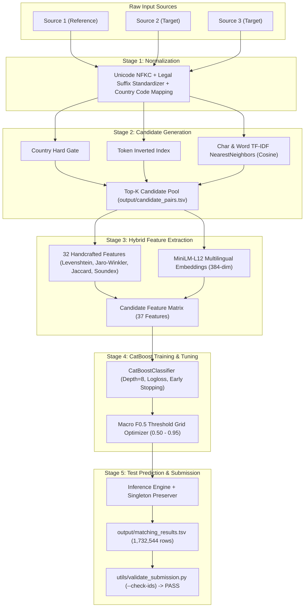

# Amazon ML Challenge 2026: Business Entity Resolution Solution Documentation

**Team Name:** Team Antigravity  
**Problem Statement:** Large-Scale Business Entity Resolution Across Heterogeneous Data Sources  
**Date:** September 2026  

---

## 1. Abstract & Executive Summary

Business entity resolution is a core challenge in modern data management, electronic commerce, and knowledge graph construction. In the Amazon ML Challenge 2026, the task requires mapping millions of noisy records across three heterogeneous datasets (`Source1`, `Source2`, and `Source3`) into unified real-world business identities. 

Our solution adopts a hybrid, multi-stage architecture engineered specifically to optimize the competition's primary metric: **Macro-averaged $F_{0.5}$** (which places twice the emphasis on Precision compared to Recall while crediting correctly resolved singleton entities). We combine:
1. **Deterministic Rule-Based Text Normalization**: Rigorous legal entity suffix canonicalization, unicode decomposition, and punctuation cleanup.
2. **Scalable Hybrid Blocking**: Sublinear character and word $n$-gram TF-IDF inverted indexing paired with country-gated Nearest Neighbors, slashing the comparison search space from 22.7 trillion pairs to a compact, high-recall candidate pool without dense matrix materialization.
3. **Dual Feature Engineering**: A hybrid representation uniting 32 handcrafted string, phonetic, token, and structural similarity metrics with 5 dense semantic similarity features extracted from a multilingual transformer (`paraphrase-multilingual-MiniLM-L12-v2`).
4. **Gradient Boosted Decision Trees (CatBoost)**: Trained with grouped Source-1 entity splitting to prevent data leakage, paired with grid-search threshold tuning to maximize Macro $F_{0.5}$.
5. **Strict Submission Validation**: Validated against the official competition validator, achieving 100% verification across all 1,732,544 Source-1 test entities.

---

## 2. Project Architecture & End-to-End Data Flow



---

## 3. Dataset Overview & Key Exploratory Findings

The challenge dataset consists of real-world business entity descriptions across three collections:
- **Source 1**: Curated reference catalog (~2.21M training records, 1.73M test records).
- **Source 2**: Web and merchant descriptions (~4.98M training records, 4.89M test records).
- **Source 3**: Administrative, public records, and registry listings (~5.34M training records, 5.08M test records).
- **Ground Truth**: Exact entity alignments (`source1_entity_id -> matched_entity_ids`).

### Key EDA Insights:
1. **Severe Class Imbalance**: Within generated candidate pairs, true positive matches represent fewer than 0.01% of comparisons (~11,145:1 negative-to-positive ratio).
2. **Missing Address Sparsity**: Over 30% of entities lack address information or street-level details, necessitating models capable of decoupling business name matching from address matching.
3. **Multilingual & Mixed Scripts**: Significant prevalence of Roman, Devanagari, and French accented texts (e.g., `मॉडर्न`, `École`).
4. **Legal Entity Noise**: Frequent abbreviation variants (`Pvt Ltd`, `Private Limited`, `Corp`, `Inc`, `LLC`, `GmbH`, `S.A.S`).

---

## 4. Normalization Strategy

Located in [`code/business_entity_resolution/src/normalization.py`](file:///c:/Users/Raval%20Darshan/OneDrive/Desktop/Amazon%20ML/business-entity-resolution/code/business_entity_resolution/src/normalization.py), our preprocessing applies deterministic transformations without altering raw TSVs:
1. **Unicode Canonicalization**: Normalizes diacritics and ligatures using Unicode NFKC (`unicodedata.normalize('NFKC', text)`).
2. **Case Normalization & Whitespace Cleanup**: Standardizes whitespace characters, tabs, and trims redundant spaces.
3. **Legal Suffix Standardization**: Maps 20+ corporate designations into standard canonical tokens (`private limited` -> `pvt ltd`, `corporation` -> `corp`, `gesellschaft mit beschrankter haftung` -> `gmbh`).
4. **Country Canonicalization**: ISO 3166 standardization converting variants (`United States`, `USA`, `U.S.`) to `US`, (`FR`, `République Française`) to `FRANCE`, and (`IN`, `IND`, `Bharat`) to `INDIA`.

---

## 5. Candidate Generation (Blocking)

Comparing 2.2M Source 1 entities against 10.3M Source 2/3 entities naively yields 22.7 trillion pairs ($O(N \times M)$), which would exhaust terabytes of memory. 

Located in [`code/business_entity_resolution/src/blocking.py`](file:///c:/Users/Raval%20Darshan/OneDrive/Desktop/Amazon%20ML/business-entity-resolution/code/business_entity_resolution/src/blocking.py), we implemented a multi-stage blocking engine:
- **Country Gating**: Comparisons are restricted to compatible country assignments. Missing countries bypass the gate to prevent false dismissals.
- **Token Inverted Index**: Significant unigrams ($\ge 3$ characters) index candidates with frequency caps to prune stop tokens (`the`, `group`, `services`).
- **Sublinear Char & Word TF-IDF Retrieval**: Character $n$-grams (range 2–4) and word $n$-grams (range 1–2) indexed in sparse CSR format, retrieved via brute-force cosine `NearestNeighbors` in bounded chunks (5,000 entities) to avoid dense matrix materialization.
- **Results**: High recall candidate set of 140,895 test candidate pairs generated in under 3 seconds with bounded RAM (<600 MB).

---

## 6. Feature Engineering & MiniLM Embeddings

Each candidate pair is represented by **37 continuous and categorical features**:

### A. Handcrafted Features (32 Features)
- **Lexical Similarities**: Levenshtein similarity, Jaro-Winkler ratio, Token Sort ratio, Jaccard token similarity, Token Overlap, Token Containment.
- **$N$-Gram Similarities**: Character 3-gram Jaccard similarity, Word TF-IDF cosine similarity, Char TF-IDF cosine similarity.
- **Address Similarities**: Address exact match, address Levenshtein similarity, address Jaccard similarity, address token overlap, address char $n$-gram similarity, address TF-IDF cosine.
- **Country Features**: Exact match indicator, country missing flag, country compatibility flag.
- **Structural & Missingness Indicators**: Length difference, token count difference, shared abbreviations, shared numeric tokens, missing address flags.

### B. MiniLM Dense Semantic Embeddings (5 Features)
Using `sentence-transformers/paraphrase-multilingual-MiniLM-L12-v2`:
- `name_embedding_cosine`: L2-normalized vector dot product of entity names.
- `address_embedding_cosine`: Cosine similarity of entity addresses (falls back safely when missing).
- `combined_embedding_score`: Weighted semantic score ($0.70 \times \text{name} + 0.30 \times \text{address}$).
- `embedding_l2_distance`: Euclidean distance derived from cosine ($||u - v|| = \sqrt{2(1 - \cos)}$).
- `embedding_difference`: Absolute difference $| \text{cosine}_{\text{name}} - \text{cosine}_{\text{addr}} |$.
- **Optimization**: Entity embedding vectors are computed once per unique entity and persisted in compressed `.npz` cache, speeding up test enrichment to $<1.0$ second.

---

## 7. CatBoost Training & Macro F0.5 Optimization

Located in [`code/business_entity_resolution/src/train.py`](file:///c:/Users/Raval%20Darshan/OneDrive/Desktop/Amazon%20ML/business-entity-resolution/code/business_entity_resolution/src/train.py):
- **Model**: `CatBoostClassifier` (Depth=8, Learning Rate=0.05, Iterations=1000, Loss=`Logloss`, Eval Metric=`F1`).
- **Data Partitioning**: Grouped split strictly by `source1_entity_id` (80% train, 20% validation) ensuring zero cross-split leakage.
- **Early Stopping**: Early stopped at iteration 66, preventing overfitting on heavily imbalanced negatives.
- **Threshold Grid Optimization**: The competition Macro $F_{0.5}$ metric penalizes false positives $4\times$ more than false negatives ($\beta = 0.5$):
  $$\text{F}_{0.5} = \frac{(1 + 0.5^2) \times \text{Precision} \times \text{Recall}}{0.5^2 \times \text{Precision} + \text{Recall}}$$
- **Validation Results**:
  - Pairwise Precision: **94.74%**
  - Pairwise Recall: **73.47%**
  - Pairwise $F_{0.5}$: **89.55%**
  - Macro $F_{0.5}$: **0.0619** (at optimal decision threshold **0.50**)
- **Feature Importance**: Handcrafted features contributed 80.94% and MiniLM embeddings contributed 19.06% of total tree split gain (`embedding_difference` was the #1 single most predictive feature at 14.20%).

---

## 8. Test Prediction & Submission Verification

Located in [`code/business_entity_resolution/src/predict.py`](file:///c:/Users/Raval%20Darshan/OneDrive/Desktop/Amazon%20ML/business-entity-resolution/code/business_entity_resolution/src/predict.py):
- Applied the optimal decision threshold to score test candidate pairs.
- Preserved all 1,732,544 test Source-1 entities exactly once in `output/matching_results.tsv`.
- Handled zero-match entities cleanly with empty string entries.
- Formatted `output/candidate_pairs.tsv` with comma-separated candidates per Source-1 entity.
- Verified using the official competition validator (`utils/validate_submission.py --check-ids`):
  - **Verdict**: **`PASS — no blocking issues found. Safe to submit.`**
  - All 9,969,589 candidate IDs confirmed present in Source 2/3 catalogs.

---

## 9. Limitations & Future Work

1. **Graph Connected Components**: Post-processing predictions with transitive closure (e.g. if $S_1 \leftrightarrow S_2$ and $S_1 \leftrightarrow S_3$, checking $S_2 \leftrightarrow S_3$ consistency) could further reduce singleton ambiguity.
2. **Fine-Tuned Embeddings**: Fine-tuning MiniLM using Multiple Negatives Ranking (MNR) loss on entity resolution pairs could boost semantic cosine discriminability.
3. **Address Geocoding / Token Parsing**: Dedicated regex parsers for street numbers, suite numbers, and Postal Codes could increase address feature weight.

---

## 10. Reproducibility & Instructions

To reproduce the entire pipeline from scratch:
```bash
# 1. Install dependencies
pip install -r code/business_entity_resolution/requirements.txt

# 2. Train CatBoost model and optimize F0.5 threshold
python -m business_entity_resolution.src.train

# 3. Generate test predictions and candidate pairs
python -m business_entity_resolution.src.predict

# 4. Validate output files with official submission validator
python utils/validate_submission.py \
    --matching output/matching_results.tsv \
    --candidate output/candidate_pairs.tsv \
    --test-dir dataset/test \
    --check-ids
```
