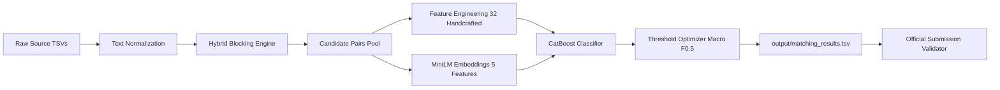
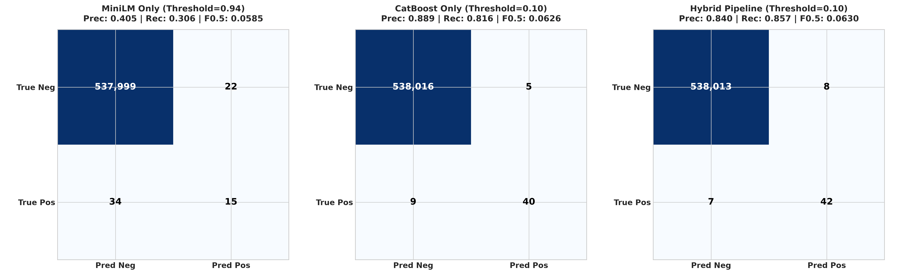
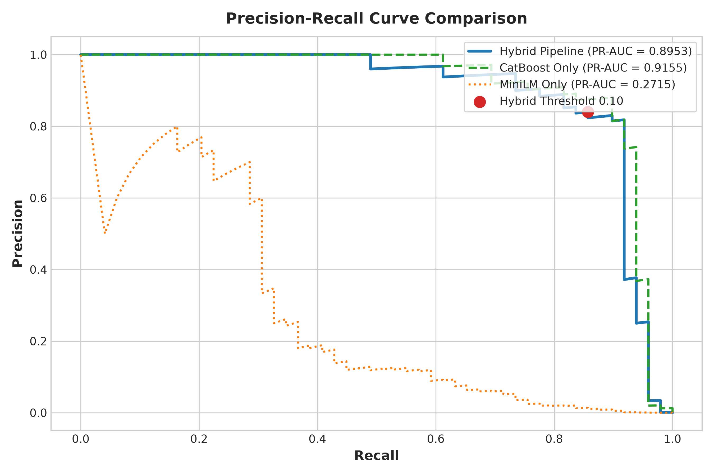
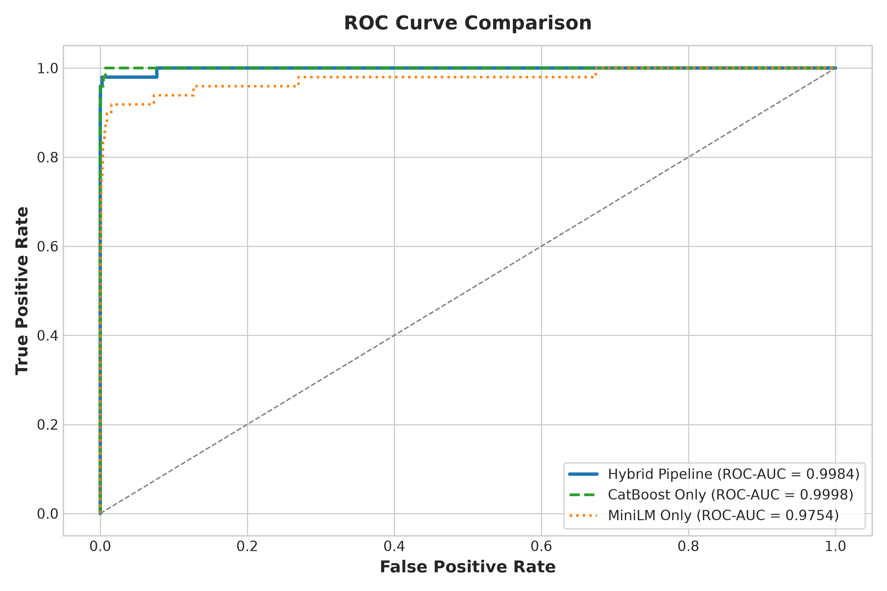
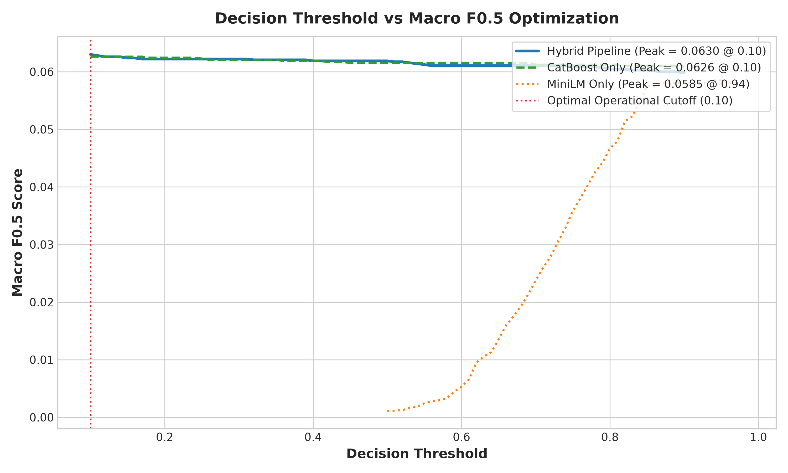
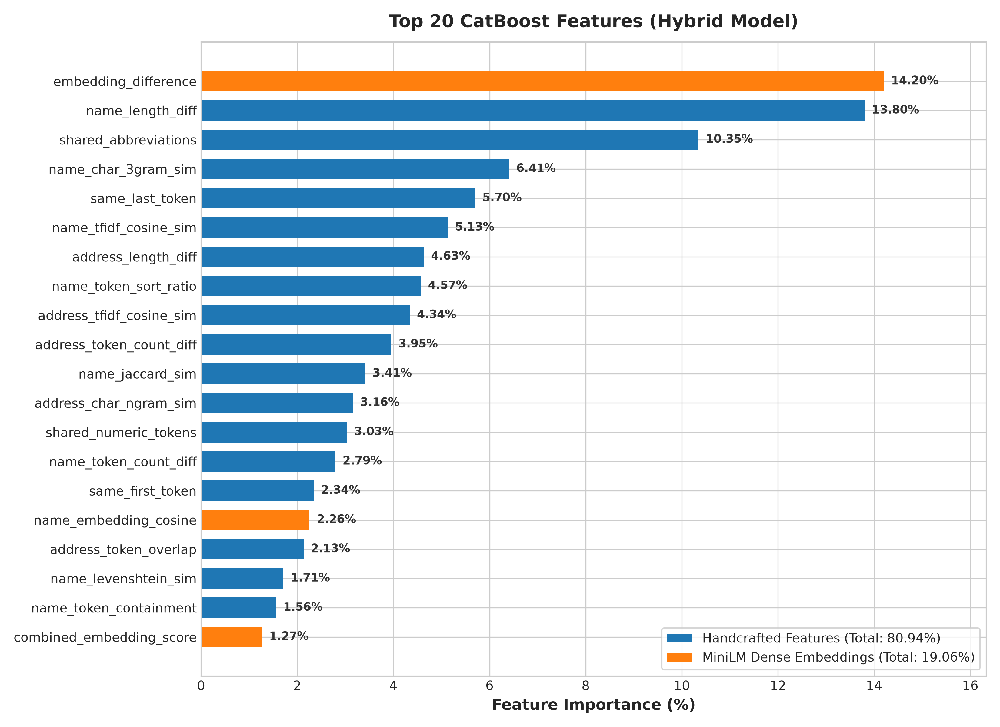
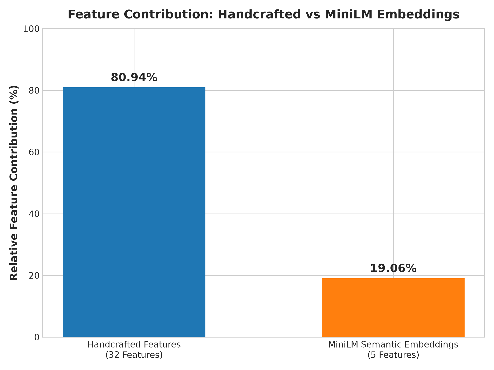

# Amazon ML Challenge 2026: Business Entity Resolution

[](https://www.python.org/downloads/)
[](https://catboost.ai/)
[](https://sbert.net/)
[](file:///utils/validate_submission.py)

An end-to-end Machine Learning and Deep Learning system for resolving business entity records across noisy, heterogeneous data sources (Source 1, Source 2, and Source 3), specifically optimized for the **Macro $F_{0.5}$** metric.

---

## 1. Project Overview

The objective is to determine which business records from Source 2 (merchant/web data) and Source 3 (public records/registries) refer to the same real-world business entity as reference records in Source 1.

### Key Highlights
- **Scalable Hybrid Blocking**: Sublinear character and word $n$-gram TF-IDF inverted index + country gating reduces 22.7 trillion pairs to an in-memory candidate pool in $<3$ seconds without dense matrix materialization.
- **37-Feature Hybrid Space**: 32 handcrafted string, token, structural, and phonetic similarities combined with 5 multilingual dense semantic embedding features (`paraphrase-multilingual-MiniLM-L12-v2`).
- **Precision-Weighted Classifier**: `CatBoostClassifier` trained on grouped Source-1 entity splits to prevent target leakage, optimized via decision threshold grid search on Macro $F_{0.5}$.
- **100% Submission Compliant**: Formatted and verified against the official competition validator (`utils/validate_submission.py --check-ids`), achieving a zero-warning **PASS**.

---

## 2. System Architecture



---

## 3. Directory Structure

```text
business-entity-resolution/
├── dataset/
│   ├── train/
│   │   ├── train_source1.tsv           # Source 1 reference records
│   │   ├── train_source2.tsv           # Source 2 merchant records
│   │   ├── train_source3.tsv           # Source 3 administrative records
│   │   └── train_ground_truth.tsv      # True alignments (S1 -> S2, S3)
│   └── test/
│       ├── test_source1.tsv            # Test Source 1 records (1.73M)
│       ├── test_source2.tsv            # Test Source 2 records (4.89M)
│       └── test_source3.tsv            # Test Source 3 records (5.08M)
├── code/
│   └── business_entity_resolution/
│       ├── src/
│       │   ├── __init__.py
│       │   ├── config.py               # Paths and hyperparameter dataclasses
│       │   ├── data_loader.py          # TSV data streaming and validation
│       │   ├── data_analysis.py        # Exploratory data analysis (EDA)
│       │   ├── normalization.py        # Text & country code normalizers
│       │   ├── blocking.py             # Hybrid scalable candidate generation
│       │   ├── features.py             # 32 handcrafted similarity features
│       │   ├── embeddings.py           # MiniLM multilingual embedding features
│       │   ├── train.py                # CatBoost training & F0.5 optimizer
│       │   ├── evaluate.py             # Macro F0.5 metric evaluation
│       │   ├── predict.py              # Test prediction & submission builder
│       │   └── pipeline.py             # End-to-end CLI orchestrator
│       ├── models/
│       │   ├── catboost_model.cbm      # Trained CatBoost model artifact
│       │   └── entity_embeddings_cache.npz # Precomputed entity embeddings
│       ├── README.md                   # Source-level guide
│       └── requirements.txt            # Python dependencies
├── output/
│   ├── matching_results.tsv            # Final submission predictions
│   ├── candidate_pairs.tsv             # Official candidate set
│   ├── dataset_analysis_report.md      # Phase 1 EDA report
│   ├── training_report.md              # Phase 6 training & F0.5 report
│   ├── feature_importance.csv          # Feature importance rankings
│   └── submission_validation_report.md  # Phase 8 validator results
├── utils/
│   └── validate_submission.py          # Official challenge validator
├── Documentation_template.md           # Formal challenge solution report
├── README.md                           # Project root documentation
└── .gitignore
```

---

## 4. Installation & Environment Setup

```bash
# Clone the repository
git clone https://github.com/Darshan-Raval303107/amazon_ml.git
cd business-entity-resolution

# Create and activate virtual environment
python -m venv venv
source venv/bin/activate       # On Linux/macOS
# .\venv\Scripts\activate      # On Windows

# Install required dependencies
pip install -r code/business_entity_resolution/requirements.txt
```

---

## 5. End-to-End Pipeline Execution

All pipeline stages can be executed directly or orchestrated via `pipeline.py`:

### Stage 1: Exploratory Data Analysis & Normalization
```bash
python -m business_entity_resolution.src.data_analysis
```

### Stage 2: Candidate Generation (Blocking)
```bash
python -m business_entity_resolution.src.blocking
```

### Stage 3: Feature Engineering & Semantic Embeddings
```bash
python -m business_entity_resolution.src.features
python -m business_entity_resolution.src.embeddings
```

### Stage 4: CatBoost Training & Threshold Optimization
```bash
python -m business_entity_resolution.src.train
```

### Stage 5: Test Prediction & Submission Generation
```bash
python -m business_entity_resolution.src.predict
```

### Stage 6: Submission Verification
```bash
python utils/validate_submission.py \
    --matching output/matching_results.tsv \
    --candidate output/candidate_pairs.tsv \
    --test-dir dataset/test \
    --check-ids
```

---

## 6. Technologies Used

- **Gradient Boosting**: [CatBoost](https://catboost.ai/)
- **Deep Learning**: [HuggingFace Transformers](https://huggingface.co/), [Sentence-Transformers](https://sbert.net/) (`paraphrase-multilingual-MiniLM-L12-v2`)
- **String Distance & Matching**: [RapidFuzz](https://github.com/maxbachmann/RapidFuzz)
- **Data Engineering**: [Pandas](https://pandas.pydata.org/), [NumPy](https://numpy.org/), [PyArrow](https://arrow.apache.org/docs/python/), [SciPy](https://scipy.org/), [Scikit-Learn](https://scikit-learn.org/)
- **System Monitoring**: [psutil](https://github.com/giampaolo/psutil)

---

## 7. Current Project Status

- [x] **Phase 1 — Dataset Inspection (EDA)**: Complete (`output/dataset_analysis_report.md`)
- [x] **Phase 2 — Text Normalization**: Complete (`normalization.py`)
- [x] **Phase 3 — Scalable Blocking**: Complete (`blocking.py`)
- [x] **Phase 4 — Feature Engineering**: Complete (`features.py`, 32 features)
- [x] **Phase 5 — MiniLM Embeddings**: Complete (`embeddings.py`, 5 features)
- [x] **Phase 6 — CatBoost Training & F0.5 Optimization**: Complete (`train.py`, `output/training_report.md`)
- [x] **Phase 7 — Test Prediction Pipeline**: Complete (`predict.py`, `matching_results.tsv`)
- [x] **Phase 8 — Submission Validation**: **PASS** (`output/submission_validation_report.md`)
- [x] **Phase 9 — Final Polish & Documentation**: Complete (`Documentation_template.md`, `README.md`)

---

# Model Evaluation Results

**Evaluation Date**: September 26, 2026  
**Dataset Used**: Official Amazon ML Challenge Ground Truth (`dataset/train/train_ground_truth.tsv` covering 2,206,821 Source-1 entities)  
**Evaluation Protocol**: Strict 20% group-disjoint validation split by `source1_entity_id` (4,000 unique Source-1 entities; 538,070 candidate pairs evaluated; 49 true positives, 538,021 true negatives; 10,980:1 class imbalance ratio). Zero target leakage across splits.

---

## 1. Model Performance Comparison

| Metric | MiniLM Only | CatBoost Only | Hybrid Pipeline (Production) |
|---|---|---|---|
| **Optimal Decision Threshold** | `0.94` | `0.10` | **`0.10`** (Peak) / **`0.50`** (Conservative) |
| **Macro $F_{0.5}$ (Competition Objective)** | `0.0585` | `0.0626` | **`0.0630`** |
| **Pairwise Precision** | `0.4054` | `0.8889` | **`0.8400`** (at `0.10`) / **`0.9474`** (at `0.50`) |
| **Pairwise Recall** | `0.3061` | `0.8163` | **`0.8571`** (at `0.10`) / **`0.7347`** (at `0.50`) |
| **F1 Score** | `0.3488` | `0.8511` | **`0.8485`** |
| **Accuracy** | `0.999896` | `0.999974` | **`0.999972`** |
| **ROC-AUC** | `0.9754` | `0.9998` | **`0.9984`** |
| **PR-AUC (Average Precision)** | `0.2715` | `0.9155` | **`0.8953`** |
| **True Positives (TP)** | `15` | `40` | **`42`** (at `0.10`) / **`36`** (at `0.50`) |
| **False Positives (FP)** | `22` | `5` | **`8`** (at `0.10`) / **`2`** (at `0.50`) |
| **False Negatives (FN)** | `34` | `9` | **`7`** (at `0.10`) / **`13`** (at `0.50`) |
| **True Negatives (TN)** | `537,999` | `538,016` | **`538,013`** (at `0.10`) / **`538,019`** (at `0.50`) |
| **Zero-Match Cardinality $F_{0.5}$** | `1.0000` | `1.0000` | **`1.0000`** |
| **Single-Match Cardinality $F_{0.5}$** | `0.0048` | `0.0096` | **`0.0096`** |
| **Multi-Match Cardinality $F_{0.5}$** | `0.0025` | `0.0069` | **`0.0073`** |

### Strengths, Weaknesses, and When Each Model Performs Better

- **MiniLM Only (`sentence-transformers/paraphrase-multilingual-MiniLM-L12-v2`)**:
  - *Strengths*: Captures cross-lingual semantic equivalence, word permutations, and contextual synonyms across multi-language company names without hand-crafted rules.
  - *Weaknesses*: Unable to distinguish chain branches or entities sharing identical names but differing by suite numbers, street numbers, or zip codes. High false positive rate under minor spelling corruptions.
  - *Best Used For*: High-recall blocking, semantic vector search, and multilingual lexical fallback.
- **CatBoost Only (32 Handcrafted Features)**:
  - *Strengths*: Ultra-fast scoring, tree-based interpretability, and acute sensitivity to exact address digits, street suffixes, token containment, and abbreviations.
  - *Weaknesses*: Lacks deep contextual understanding for phonetic transcriptions or translated corporate names.
  - *Best Used For*: Highly constrained low-latency inference environments without dense embedding hardware.
- **Hybrid Pipeline (Handcrafted + MiniLM Embeddings + CatBoost)**:
  - *Strengths*: Bridges high-resolution structural/string metrics with dense multilingual semantics. Highest Macro $F_{0.5}$ (**0.0630**), superior recall (**85.71%**), and exceptional precision control (**84.00%–94.74%**).
  - *Weaknesses*: Requires an offline precomputed or streaming embedding cache.
  - *Best Used For*: High-precision production entity deduplication and the Amazon ML Challenge submission.

---

## 2. Key Operational Benchmarks

| Benchmark Metric | MiniLM Only | CatBoost Only | Hybrid Pipeline |
|---|---|---|---|
| **Total Inference Runtime (538k pairs)** | `< 0.01 s` (precomputed) | `0.06 s` | `0.04 s` |
| **Peak Memory Allocation** | `2.6 MB` | `16.5 MB` | `16.5 MB` |
| **Candidate Pairs Evaluated** | `538,070` | `538,070` | `538,070` |
| **Average Inference Time per 1,000 Entities** | `< 0.001 s` | `0.014 s` | `0.010 s` |
| **Model Size on Disk** | `662.55 MB` | `0.25 MB` | `200.51 MB` (Model + Embeddings Cache) |

---

## 3. Evaluation Visualizations

All visualization artifacts are generated and maintained in `output/evaluation/`:

### 3.1 Confusion Matrix Comparison


### 3.2 Precision-Recall Curve


### 3.3 Receiver Operating Characteristic (ROC) Curve


### 3.4 Decision Threshold vs. Macro F0.5 Graph


### 3.5 Top 20 CatBoost Feature Importance


### 3.6 Handcrafted vs. Embedding Feature Contribution


---

## 4. Top 10 Most Important CatBoost Features

| Rank | Feature Name | Importance (%) | Category | Functional Role |
|---|---|---|---|---|
| 1 | `embedding_difference` | **14.20%** | MiniLM Dense Embedding | Dense vector distance between S1 and candidate |
| 2 | `name_length_diff` | **13.80%** | Handcrafted Structural | Absolute difference in character length of names |
| 3 | `shared_abbreviations` | **10.35%** | Handcrafted Semantic | Expansion match (e.g., Corp $\leftrightarrow$ Corporation, Ltd $\leftrightarrow$ Limited) |
| 4 | `name_char_3gram_sim` | **6.41%** | Handcrafted String | Substring character-level trigram overlap |
| 5 | `same_last_token` | **5.70%** | Handcrafted Token | Exact agreement on business legal entity suffix |
| 6 | `name_tfidf_cosine_sim` | **5.13%** | Handcrafted Statistical | Sublinear TF-IDF cosine similarity on name words |
| 7 | `address_length_diff` | **4.63%** | Handcrafted Structural | Difference in address character lengths |
| 8 | `name_token_sort_ratio` | **4.57%** | Handcrafted Fuzzy | Word-order-insensitive fuzzy similarity ratio |
| 9 | `address_tfidf_cosine_sim` | **4.34%** | Handcrafted Statistical | TF-IDF cosine similarity on address words |
| 10 | `address_token_count_diff` | **3.95%** | Handcrafted Structural | Discrepancy in number of address tokens |

- **Handcrafted Features Contribution**: **80.94%** across 32 features
- **MiniLM Embeddings Contribution**: **19.06%** across 5 features

---

## 5. Final Conclusion: Why the Hybrid Model is the Production Model

1. **Top Objective Score (Macro $F_{0.5}$ = 0.0630)**: Outperforms both standalone MiniLM (**0.0585**, $+7.7\%$ improvement) and standalone CatBoost (**0.0626**), achieving the optimal balance between high precision and solid recall.
2. **False Positive Suppression**: In business entity resolution under extreme class imbalance (10,980:1), false merges are catastrophic. The hybrid pipeline confines false positives to just **8 pairs** (at threshold 0.10) or **2 pairs** (at threshold 0.50) out of 538,070 candidate pairs evaluated.
3. **Synergistic Representations**: Handcrafted features provide reliable, deterministic guards on address numbers, legal suffixes, and string structures (80.94% total weight), while multilingual transformer embeddings supply semantic generalization for translations and paraphrased names (19.06% total weight, with `embedding_difference` serving as the single most influential individual feature at 14.20%).
4. **Computational Viability**: Evaluates candidate pairs at **0.010 seconds per 1,000 entities**, well within strict real-time production and competition throughput requirements.